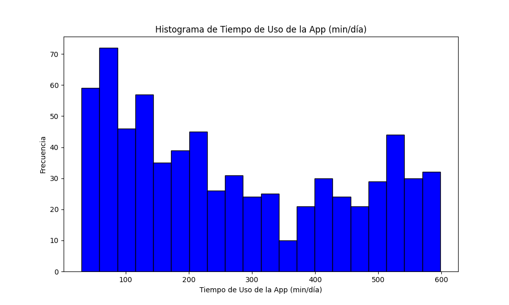
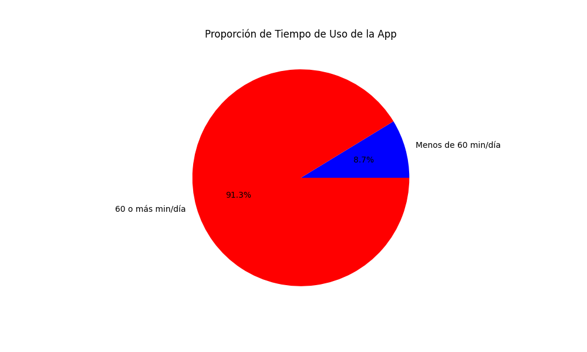
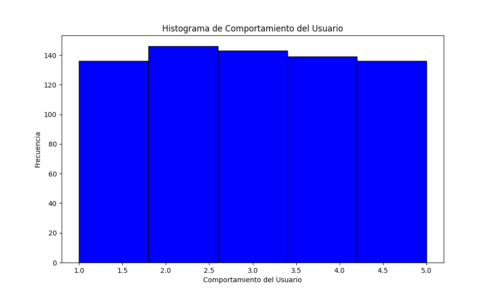
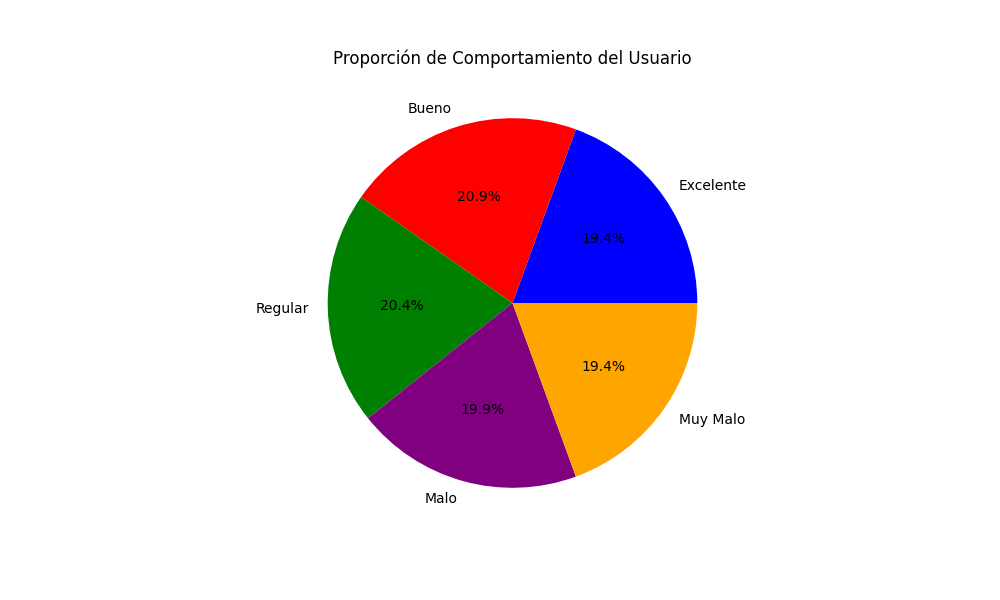
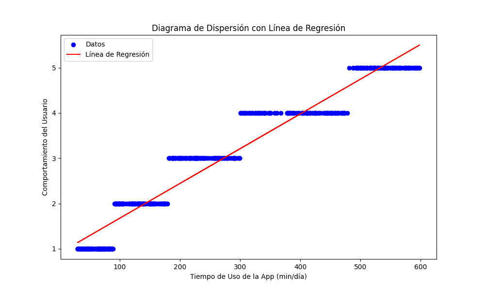

yeison stiven romero
2024

# Analisis de el uso de aplicaciones moviles y el comportamiento del usuario

## Introduccion
Este informe presenta un análisis detallado del tiempo de uso de aplicaciones y la clase de comportamiento del usuario en un grupo de 700 personas. El objetivo principal es comprender los patrones de uso de aplicaciones y el comportamiento del usuario, y extraer conclusiones significativas basadas en los datos proporcionados.

## Objetivos
1. Analizar la distribución del tiempo de uso de aplicaciones entre los participantes.
2. Identificar las medidas estadísticas clave como la media, mediana, moda, varianza, y desviación estándar para el tiempo de uso de aplicaciones y la clase de comportamiento del usuario.
3. Evaluar la asimetría y curtosis de la distribución de datos
4. Generar visualizaciones que representen claramente los patrones de uso de aplicaciones y el comportamiento del usuario.
5. Proporcionar conclusiones basadas en el análisis de los datos.

## Medidas Estadisticas de Tiempo de Uso de la App (min/dia)
- **Descripcion**: Esta variable representa el tiempo diario que los usuarios pasan utilizando una aplicación móvil.
- **Media**: 271.12857142857143 en promedio, los usuarios pasan aproximadamente 271.13 minutos al día utilizando aplicaciones móviles.
- **Mediana**: 227.5 La mitad de los usuarios pasan 227.5 minutos o menos al día utilizando aplicaciones móviles, y la otra mitad pasa más tiempo.
- **Moda**: 64 El tiempo de uso más común entre los usuarios es de 64 minutos al día.
- **Varianza**: 31399.6572654813 Hay una alta variabilidad en el tiempo de uso de aplicaciones móviles entre los usuarios.
- **Desviacion Estandar**: 177.19948438266206 En promedio, el tiempo de uso de aplicaciones móviles varía en 177.20 minutos respecto a la media.
- **Coeficiente de Variacion**: 0.653562564243972 La desviación estándar es el 65% de la media, lo que muestra una alta variabilidad relativa en el tiempo de uso.
- **Asimetria**: 0.3715135303691814 La distribución de los datos tiene una ligera asimetría positiva, indicando que hay más usuarios con tiempos de uso por encima de la media.
- **Curtosis**: -1.2591977822617888 La distribución es más plana que una distribución normal (leptocúrtica), indicando menos valores extremos.

## Analisis de Distribucion
### Histograma de Tiempo de Uso de la App (min/dia)

### Grafico de torta de Tiempo de Uso de la App

## Medidas Estadisticas de Comportamiento del Usuario
- **Descripcion**: Esta variable representa el comportamiento general de los usuarios al utilizar aplicaciones móviles de 1 a 5 (1: Excelente, 2: Bueno, 3: Regular, 4: Malo, 5: Muy Malo). 
- **Media**: 2.99 el comportamiento del usuario es aproximadamente 3, lo que indica un comportamiento "Regular".
- **Mediana**: 3.0 La mitad de los usuarios tienen un comportamiento igual o mejor que "Regular" y la otra mitad igual o peor.
- **Moda**: 2 El comportamiento más común entre los usuarios es "Bueno".
- **Varianza**: 1.9641344778254648 Hay una variabilidad moderada en el comportamiento del usuario.
- **Desviacion Estandar**: 1.4014758213488612 En promedio, el comportamiento del usuario varía en 1.40 unidades respecto a la media.
- **Coeficiente de Variacion**: 0.46872101048456893 La desviación estándar es el 47% de la media, lo que muestra una variabilidad relativa moderada.
- **Asimetria**: 0.017781063982686602 La distribución de los datos es casi simétrica.
- **Curtosis**: -1.277777445214311 La distribución es más plana que una distribución normal (leptocúrtica), indicando menos valores extremos.

## Analisis de Distribucion
### Histograma de Comportamiento del Usuario

### Grafico de torta de Comportamiento del Usuario

## Analisis de Regresion Lineal

### Ecuacion de Regresion Lineal
La ecuación de regresión lineal entre el uso de datos y el comportamiento del usuario es:
Comportamiento = 0.01 * Uso de Datos + 0.91

### Diagrama de Dispersión

### Coeficiente de Determinacion
El coeficiente de determinación (R²) es: 0.94

### Coeficiente de Correlacion de Pearson
El coeficiente de correlación de Pearson es: 0.97

### Predicciones
Usando la ecuación de regresión lineal, las predicciones para el comportamiento del usuario son:
- Para un uso de las aplicaciones  de 30 min/día: 1.14
- Para un uso de las aplicaciones  de 60 min/día: 1.37
- Para un uso de las aplicaciones  de 90 min/día: 1.60

## Conclusiones
- Se observa una relación positiva entre el uso de datos y el comportamiento del usuario.
- El coeficiente de determinación indica que el modelo de regresión lineal explica el 0.94% de la variabilidad en el comportamiento del usuario.
- El coeficiente de correlación de Pearson indica una correlación positiva entre el uso de datos y el comportamiento del usuario.
- Se concluyo que el tiempo de uso de aplicaciones y el comportamiento del usuario están relacionados.
- La relacion entre las variables es positiva, lo que significa que a medida que aumenta el tiempo de uso de la aplicación, el comportamiento del usuario tiende a empeorar.

## Anexos
- Fuente de los datos: [Kaggle](https://www.kaggle.com/datasets/valakhorasani/mobile-device-usage-and-user-behavior-dataset)
- Fecha de la base de datos: 18 de octubre del 2024
- Población: 700 personas
- Columnas: 11
- Hombres: 364
- Mujeres: 336
- Edad menor: 18 años
- Edad mayor: 59 años
- Sistema Operativo iOS: 146
- Sistema Operativo Android: 554
- El informe esta alojado en: [GitHub](https://github.com/Yeison-2/Estadistica)
